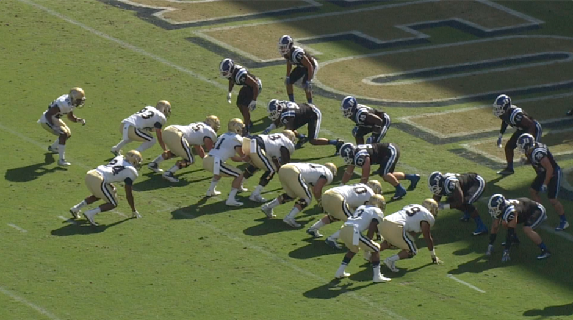

# Automatic Classification of American Football Plays




## Introduction
In this project, we develop a computer vision model to classify videos of 
football plays by type. This model will be incorporated in a web application 
where users can upload new videos and receive the prediction. 
This service aims to reduce the need for human intervention when classification 
is needed.

Project Prototype is deployed on http://54.221.66.111:5000/

## Potential use cases:
* Provisioning labeled videos to direct-to-consumer applications
* Quick retrieval of classified videos for coaches and players
* Creating a better analysis to predict play outcomes that the offense team might perform
* Integration with media services

## Installations:
* Python 3.8.3 is required
* After installing Python 3.8.3, run
```console
pip install website/requirements.txt
```
## Running server on local host:
```console
cd website
export FLASK_APP=app.py
flask run
```
