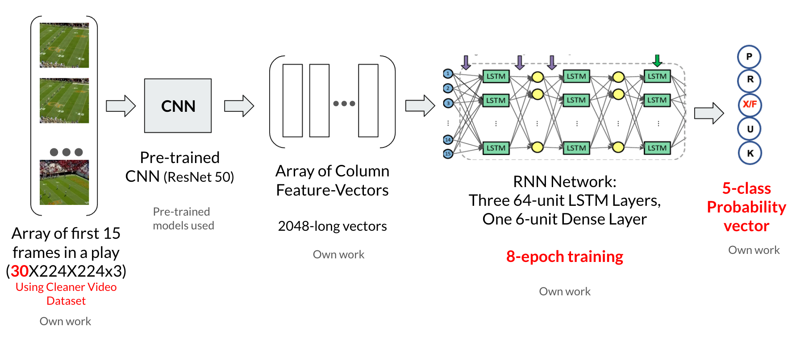

#Model Training Process

## Dataset Pre-processing (*Data Pre-Processing.ipynb*)
* We pre-process the data using OpenCV, Pandas, Numpy.
* We load dataset information (.csv) and create *Training Labels* as **one-hot encoding** format.
* To create *Training Samples*, We use **OpenCV** to split video data into static frame(224x224) at 2 frames per second and save entire dataset as **Numpy Array**.
## Training CNN-RNN Model (*CNN-RNN Model.ipynb*)
* We use pre-trained CNN model(Resnet50 or VGG16) to create an array of column feature vectors.
* We then build RNN network from multiple LSTM layers and output Probability vector of different types of plays.
## Saved Models (*.h5*)
* We save our trained models with different tuning parameters and optimizations, which will be used by our web application.